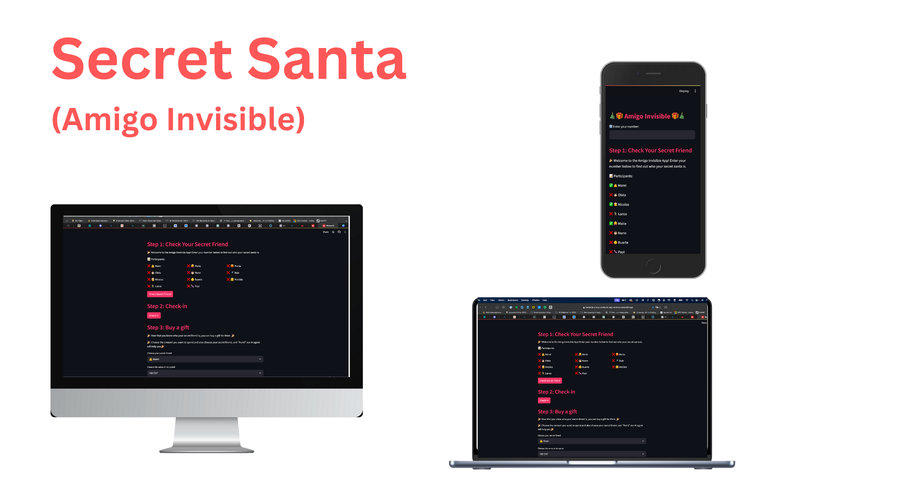

Link to the live project: [Amigo Invisible App](https://tuminha-amigo-invisible-app-sx1moy.streamlit.app)


## Table of Contents

1. [Amigo Invisible (Secret Santa) App Overview](#amigo-invisible-secret-santa-app-overview)
2. [How the App Works](#how-the-app-works)
   - [Random Assignment](#random-assignment)
   - [Participant Anonymity](#participant-anonymity)
   - [Streamlit Frontend](#streamlit-frontend)
   - [Gift Giving Made Easy](#gift-giving-made-easy)
3. [Features of the Amigo Invisible (Secret Santa) App](#features-of-the-amigo-invisible-secret-santa-app)
   - [Secret Number Assignment](#secret-number-assignment)
   - [Check-In Functionality](#check-in-functionality)
   - [AI-Powered Gift Recommendations](#ai-powered-gift-recommendations)
4. [Technical Design](#technical-design)
   - [Flowchart](#flowchart)
5. [Technologies Used](#technologies-used)
   - [Languages and Libraries](#languages-and-libraries)
   - [Web Framework](#web-framework)
   - [AI Integration](#ai-integration)
   - [Environment and API Management](#environment-and-api-management)
   - [Development and Version Control](#development-and-version-control)
6. [Customization of AI Agent](#customization-of-ai-agent)
7. [Existing Features](#existing-features)
   - [Welcome Screen](#welcome-screen)
   - [Main Menu](#main-menu)
   - [Participant Assignment and Check-In](#participant-assignment-and-check-in)
   - [AI-Powered Gift Recommendations](#ai-powered-gift-recommendations)
   - [Responsive Web Interface](#responsive-web-interface)
   - [Administrative Features](#administrative-features)
8. [Features Left to Implement](#features-left-to-implement)
9. [Testing](#testing)
   - [General Testing](#general-testing)
   - [Development and Deployment Environment](#development-and-deployment-environment)
   - [PEP8 Compliance](#pep8-compliance)
   - [Automated Testing](#automated-testing)
   - [User Stories Testing](#user-stories-testing)
   - [Lighthouse Performance Report](#lighthouse-performance-report)
10. [Bugs and Fixes](#bugs-and-fixes)
   - [Encountered Issues](#encountered-issues)
   - [Unresolved Issues](#unresolved-issues)
11. [Testing Approach and Results](#testing-approach-and-results)
   - [Manual Testing Highlights](#manual-testing-highlights)
   - [Automated Testing Highlights](#automated-testing-highlights)
   - [Test Execution](#test-execution)
   - [Test File Reference](#test-file-reference)
12. [Deployment](#deployment)
13. [Fork and Clone](#fork-and-clone)
14. [Acknowledgements and Credits](#acknowledgements-and-credits)


## Amigo Invisible (Secret Santa) App Overview

The Amigo Invisible, or Secret Santa, is an innovative app designed to add fun and simplicity to the traditional Secret Santa game. The core purpose of this app is to facilitate families, friends, or colleagues in randomly assigning a 'secret friend' or 'secret Santa' to each participant in an unbiased and exciting manner.

## How the App Works

### Random Assignment
Utilizing a Python-based backend, the app intelligently shuffles a list of participants and randomly assigns each person a 'secret Santa'.

### Participant Anonymity
Each participant is assigned a unique secret number to maintain confidentiality.

### Streamlit Frontend
To enhance user experience, the app boasts a user-friendly frontend developed with Streamlit. Participants can simply input their secret number on this interface to discover who their secret Santa is.

### Gift Giving Made Easy
The overarching goal is to ensure every participant is assigned someone who will thoughtfully select and give a present, making the gift exchange process seamless and enjoyable.

This app is more than just a tool; it's a digital facilitator of joy and surprise, making your Secret Santa event hassle-free and memorable.

## Features of the Amigo Invisible (Secret Santa) App

The Amigo Invisible app is designed with user engagement and convenience in mind, offering a suite of features that enhance the Secret Santa experience. These features are categorized into three primary sections:

### Secret Number Assignment:

Each participant is assigned a unique secret number by the administrator of the game.
This number is confidentially communicated from the administrator to the participant.
Participants enter their secret number into the app to reveal their assigned Secret Santa. This process ensures anonymity and adds an element of surprise to the gift exchange.

### Check-In Functionality:

The app includes a 'Check-In' feature, which allows participants to confirm their participation and assignment.
Once a participant checks in, the information is updated in the app's frontend. This feature provides transparency, enabling other participants to see who has already been assigned a secret friend.

### AI-Powered Gift Recommendations:

A standout feature of the app is its integration with an AI-powered recommendation system.
By leveraging OpenAI's language models through an API, the app offers personalized gift suggestions.
Participants simply input their budget, and the AI suggests suitable gifts for their secret friend. This innovative feature takes the guesswork out of gift selection, ensuring thoughtful and appropriate presents within the set budget.

These carefully crafted features make the Amigo Invisible app not just a tool for organizing Secret Santa events but a comprehensive platform that enhances the entire experience, from assignment to gift selection, fostering a joyful and memorable holiday tradition.

## Technical Design

### Flowchart

Based on the features described above, the following flowchart illustrates the technical design of the Amigo Invisible app:

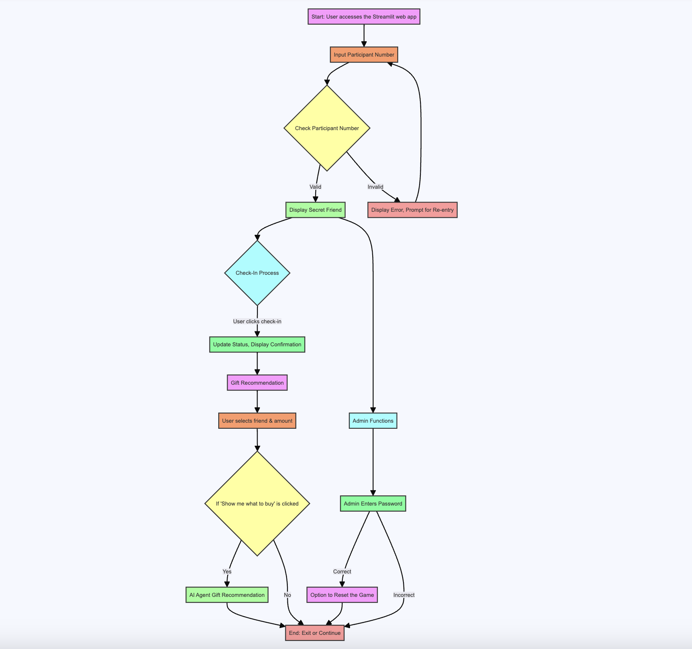

## Technologies Used

The Amigo Invisible app leverages a combination of languages, libraries, and tools to deliver a fully functional secret Santa application. Below are the main technologies and third-party libraries employed, along with their purposes and links to their official documentation.

### Languages and Libraries

- **[Python](https://www.python.org/)**: The primary programming language used for developing both the logic and the web interface of the application.
- **[JSON (JavaScript Object Notation)](https://docs.python.org/3/library/json.html)**: Utilized for storing and manipulating data, serving as the format for saving participant assignments.
- **[os](https://docs.python.org/3/library/os.html)**: A Python standard library providing a way to interact with the operating system, used for file operations like checking if the `assignments.json` file exists.
- **[random](https://docs.python.org/3/library/random.html)**: A Python standard library used to generate random elements, ensuring that secret Santa assignments are fair and unpredictable.

### Web Framework

- **[Streamlit](https://streamlit.io/)**: An open-source app framework for Machine Learning and Data Science teams. It is used to create the web interface that participants interact with, due to its rapid development capabilities and ease of use.

### AI Integration

- **[OpenAI's GPT-4 API](https://beta.openai.com/)**: The cutting-edge language model that powers the AI component of the app, providing intelligent and personalized gift recommendations.

### Environment and API Management

- **[python-dotenv](https://pypi.org/project/python-dotenv/)**: A Python library for reading key-value pairs from a `.env` file and setting them as environment variables, used to manage sensitive data such as the OpenAI API key.
- **[OpenAI Python Client](https://github.com/openai/openai-python)**: The official Python library for the OpenAI API, facilitating the integration of AI functionalities into the app.

### Development and Version Control

- **[Git](https://git-scm.com/)**: The distributed version-control system for tracking changes in the source code during development.
- **[GitHub](https://github.com/)**: Provides hosting for software development and version control using Git, serving as the central repository for the app's codebase.
- **[Visual Studio Code (VS Code)](https://code.visualstudio.com/)**: The preferred Integrated Development Environment (IDE) for writing, debugging, and editing the application's code, chosen for its extensive support for Python and integration with Git.


## Customization of AI Agent

One of the unique aspects of the Amigo Invisible App is its AI-powered gift recommendation feature, which leverages OpenAI's GPT-4 API. The prompt given to the AI can be fully customized to align with the specific preferences and characteristics of the participants. This customization ensures that the gift suggestions are not only creative but also personal and thoughtful.

To tailor the AI prompts for your own Secret Santa event, you can modify the `app.py` file. Here's a shell command example to open the file in your editor and make the desired changes:

```shell
nano app.py
```
Or, if you prefer using Visual Studio Code:

```shell
code app.py
```
Within the `app.py` file, navigate to the section where the AI prompt is set up and adjust the text to better reflect the interests and personalities of your participants. This allows you to create a more engaging and personalized experience for each user of the app.

In the `app.py` file, look for the following code block:

```python
user_message = {
    "role": "user",
    "content": (
        f"Based on the following information, what should I buy for "
        f"{secret_friend} with the assigned budget of {amount}?\n"
        "👸 Mami: Mami adores luxury! For her, think lavish and expensive. "
        "Recommend gifts worth at least 50 Swiss francs. Ideas include "
        "elegant purses, diamonds, or anything that screams opulence. "
        "Inject humor by nudging towards extravagant choices.\n"
        "🤦‍♀️ Maite: At 17, Maite, the mom to Mami and Marta, enjoys a"
        " variety of things. She's into yoga, loves her grandkids, "
        "and adores walking her dog. "
        "Gift suggestions can range from yoga gear, fun items for her "
        "grandkids, "
        "to dog accessories. Keep it varied and surprising!\n"
        "😡 Marta: Marta, the 37-year-old McKinsey genius, needs gifts "
        "that stimulate her intellect. "
        "Suggest puzzles, challenging books, or anything that sparks"
        " intellectual curiosity. Ensure recommendations are as smart"
        " and savvy as she is.\n"
        "👧🏻 Oleia: At 8, Oleia loves dogs, parties, and painting."
        " Recommend fun, age-appropriate gifts like art supplies,"
        " party games, or anything dog-themed. Ensure suggestions are"
        " full of energy and creativity.\n"
        "👦🏻 Nuno: Nuno, 15, is a golf fanatic and interested in money."
        " Suggest golf-related items, from equipment to accessories."
        " Maybe even a humorous suggestion about a piggy bank!\n"
        "🚿 Buis: Our 13-year-old video game enthusiast, Buis, could"
        " use some outdoor fun. Suggest gifts that encourage active"
        " hobbies like sports equipment or outdoor adventure games."
        " Encourage more sunshine and less screen time.\n"
        "🎅 Nicolas: 12-year-old Mr. Christmas loves painting,"
        " crafting, and anything creative, especially with airplanes"
        " or electricity themes. Suggest DIY kits, craft supplies,"
        " or model airplanes. Emphasize the festive and creative"
        " aspects.\n"
        "👶 Buarte: At just 4 years old, Buarte adores robots,"
        " dinosaurs, dogs, and Christmas. Suggest educational robot toys,"
        " dinosaur figures, or dog-themed books. Keep ideas playful"
        " and educational.\n"
        "👧 Matilda: Another 4-year-old, Matilda recently lost a tooth."
        " Suggest child-friendly gifts like plush toys or storybooks."
        " Add a light-hearted suggestion about dental implants for her"
        " missing tooth to inject humor.\n"
        "🚴 Lance: Lance loves sports and is knowledgeable about"
        " almost everything. Recommend sports gear or books on diverse"
        " topics. Encourage discussions and learning through your gift"
        " suggestions.\n"
        "🍆 Papi: At 45, Papi values family over material gifts."
        " Suggest something simple and inexpensive, less than 20 Swiss"
        " francs, like a family photo frame or a handmade gift."
        " Emphasize the joy of family togetherness."
    )
}
```
This is the prompt that is sent to the AI agent. You can customize this prompt to better suit the participants of your Secret Santa event. For example, you can change the descriptions of the participants, add new participants, or modify the gift suggestions.

After modifying the prompt, you can also adjust the parameters of the OpenAI API call, which is done in the following code block:

```python
response = client.chat.completions.create(
    model="gpt-4-1106-preview",
    messages=[system_message, user_message],
    max_tokens=3000,
    temperature=0.8
)
```
You can adjust the `max_tokens` parameter to control the length of the AI's response, or the `temperature` parameter to control the randomness of the AI's response.

Remember to save your changes and restart the app for the changes to take effect.

## Existing Features
### Welcome Screen
**Initial Interaction:** Upon launching the app, users are greeted with a welcoming interface.
**Participant Number Entry:** Participants are prompted to enter their unique secret number to proceed.
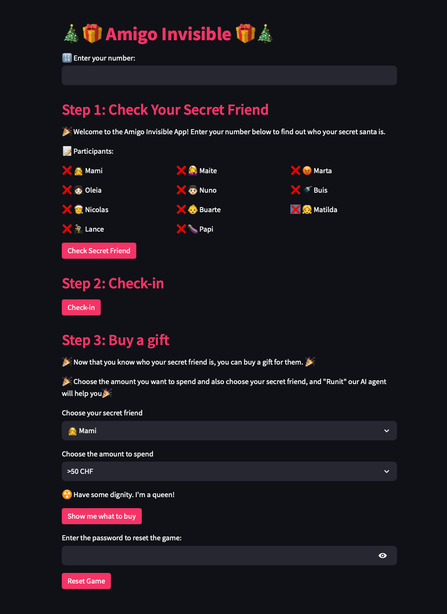
### Main Menu
**Secret Friend Reveal:** After entering a valid number, participants can discover their secret Santa.
**Instructions and Rules:** Clear guidelines are provided on how to participate and engage with the app.
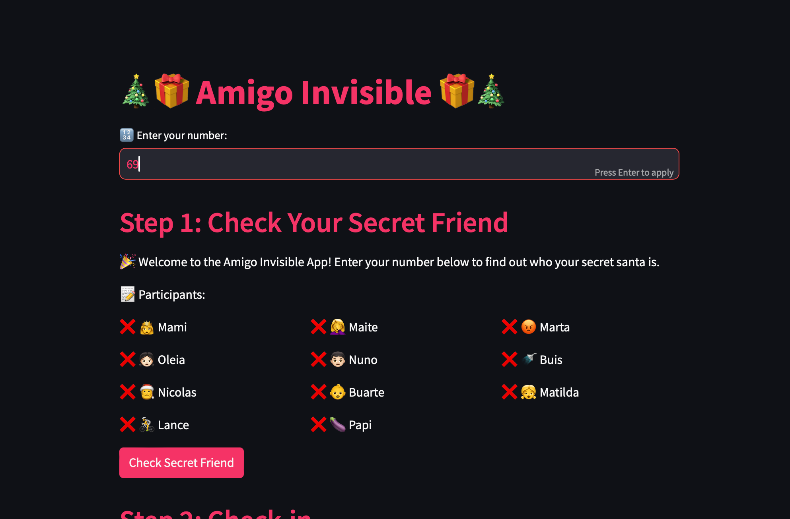
### Participant Assignment and Check-In
**Random Secret Santa Assignment:** The app assigns a secret Santa to each participant in a random and fair manner.
**Check-In Functionality:** Participants can check in, and the app updates this status for all users to see.
**Transparency and Engagement:** The app promotes a transparent process where everyone knows who has checked in.
**Real-Time Updates:** After the check-in, the list of users that have already checked in is updated and visible to everyone. However, the page needs to be refreshed to see the updated list.
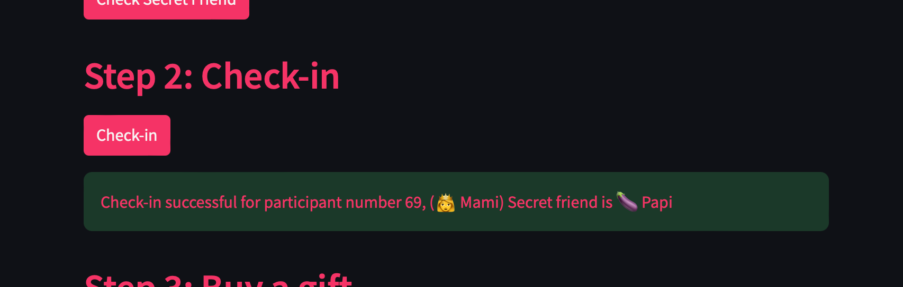
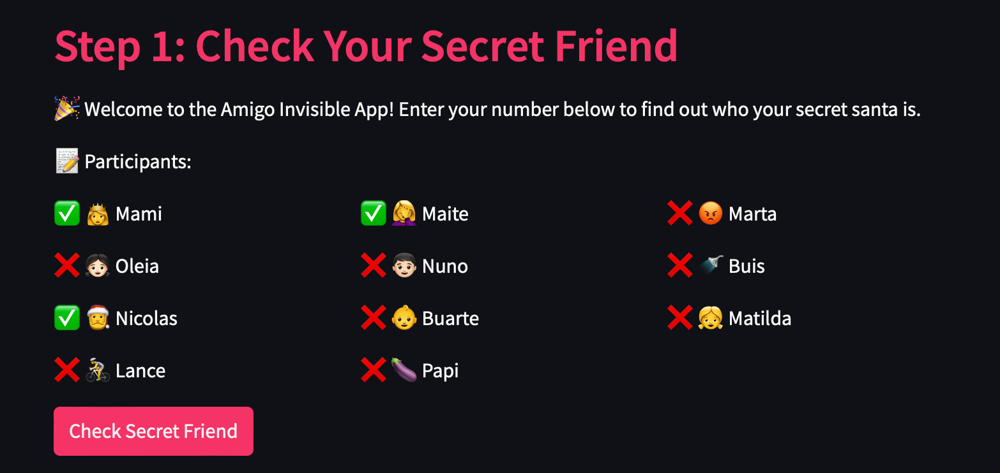
### AI-Powered Gift Recommendations
**Interactive Gift Suggestion:** Participants can use the OpenAI-powered feature to get gift suggestions.
**Personalized Experience:** By inputting their budget and the assigned secret friend, users receive customized gift ideas.
**Enhanced User Experience:** This feature adds a layer of innovation and fun to the gift selection process.
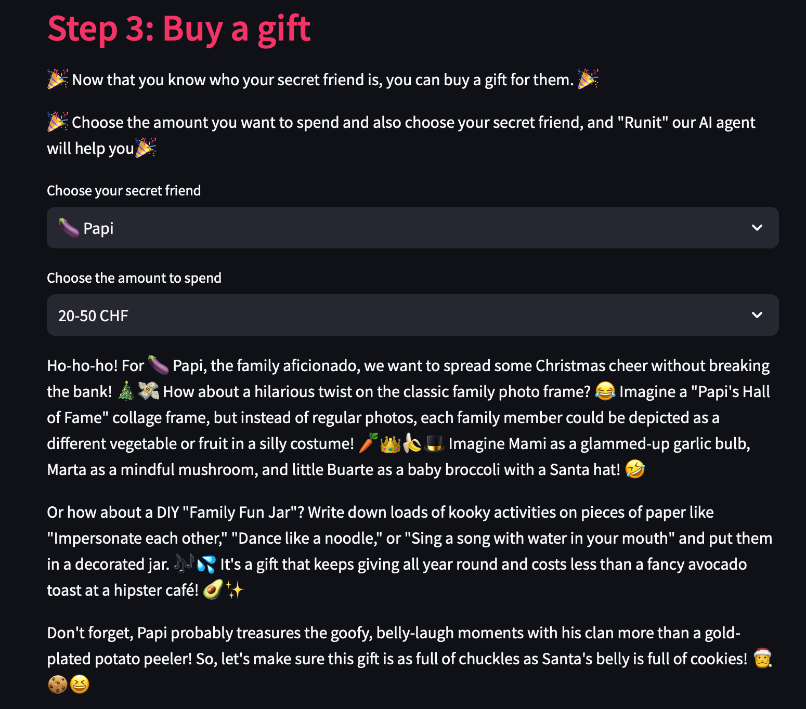
### Responsive Web Interface
**Streamlit Framework:** The app's frontend, built with Streamlit, offers a responsive and intuitive user interface.
**Cross-Platform Accessibility:** Accessible on various devices, ensuring a wide reach among users.
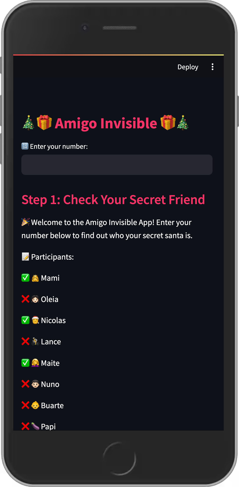
### Administrative Features
**Game Reset Option:** Administrators can reset the game, including reassigning secret Santas, using a secure password.
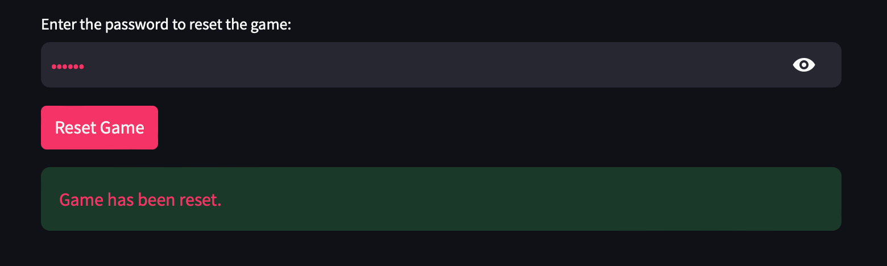

**Data Management:** Efficient handling of participant data and assignments through JSON file manipulation.
**Environment Variables:** Secure management of API keys and sensitive data using the dotenv library.
**Error Handling:** The app provides informative error messages for invalid inputs or file access issues.

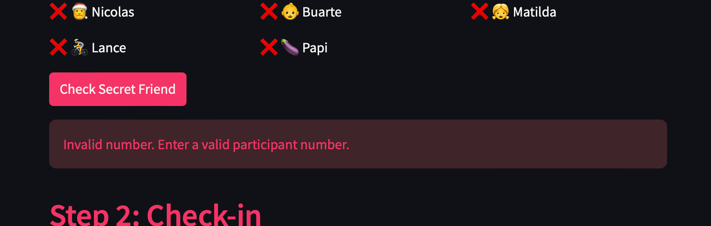

## Features Left to Implement
**Multilingual Support:** To cater to a diverse user base by providing multiple language options.
**Enhanced Customization:** Allowing users to add personal touches, like custom messages to their secret friends.
**Participant Dashboard:** A feature for participants to view past games, their gift history, and more.
**Mobile App Version:** Expanding the platform to a dedicated mobile application for increased accessibility.

## Testing

### General Testing
The Amigo Invisible app underwent rigorous testing to ensure functionality, usability, and reliability. Testing was conducted across various aspects of the application, including code quality, user interaction, and AI integration.

### Development and Deployment Environment
The app was developed and tested in a robust development environment, ensuring consistent performance across different platforms. Additionally, the app was deployed and tested to confirm its functionality in a live setting.

### PEP8 Compliance
Code quality was a priority, and as such, all Python files (amigo_invisible.py, app.py) were checked for PEP 8 compliance using the Code Institute's PEP8 online tool. The results indicated 100% compliance, with no errors found across all files.


### Automated Testing
Automated tests were written and run using Python's unittest framework, ensuring that all core functionalities of the application were working as expected. The test.py file contains a suite of tests that cover various scenarios, including participant assignment, secret friend revelation, and error handling. All tests were executed successfully, confirming the robustness of the application logic.

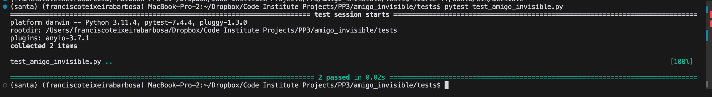

### User Stories Testing
Testing was also aligned with user stories to ensure that the app met the needs and expectations of its users. Each user story was methodically tested to verify that the app provided the intended experience and functionality.

#### Participant Number Entry:
* Action: Participants enter their secret number.
* Expected Result: The app reveals the assigned secret Santa.
* Actual Result: Worked as expected.

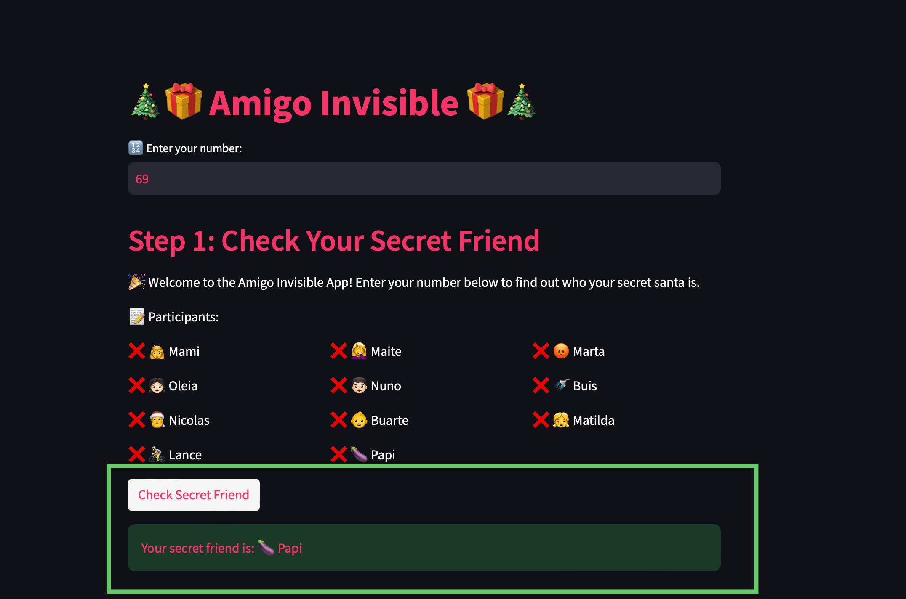

#### Check-In Functionality:
* Action: Participants use the check-in feature.
* Expected Result: The app updates the check-in status.
* Actual Result: Worked as expected.


#### AI-Powered Gift Recommendations:
* Action: Users input their budget and get gift suggestions.
* Expected Result: The app provides relevant gift recommendations.
* Actual Result: Worked as expected, with AI suggestions aligning with user inputs.

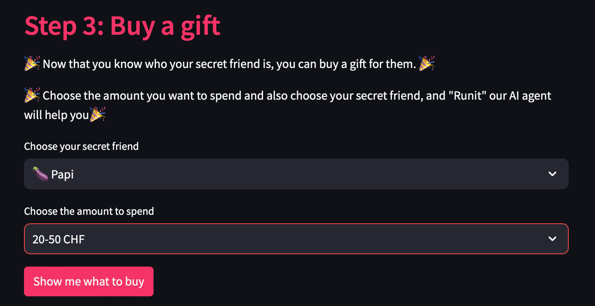

#### Game Reset by Admin:
* Action: Admin enters the reset password and resets the game.
* Expected Result: The game resets and reassigns secret Santas.
* Actual Result: Functioned correctly, allowing for a fresh start of the game.


## Bugs and Fixes

Throughout the development of the Amigo Invisible app, several challenging and interesting bugs were encountered and subsequently resolved. Below is an overview of notable issues and their solutions:

### Encountered Issues

#### Import Errors in Testing

During the unit testing phase, issues arose with the import statements. Functions like get_name and get_secret_friend could not be imported from the amigo_invisible.amigo_invisible module, leading to failed tests and import errors.

**Solution:** The functions were initially nested within assign_secret_friend, making them inaccessible to the test module. The code was refactored to define these functions at the top level of the amigo_invisible.py file, ensuring they were importable and testable.

#### Conflicts with Variable Declarations

The assignments dictionary was used before its definition within certain functions, causing conflicts and undefined variable errors.

**Solution:** The assignments variable was intended to hold data loaded from a file, rather than being a global variable. The functions were refactored to accept assignments as a parameter, ensuring it was defined prior to use. This change also involved updating the logic to handle cases where the assignments.json file did not exist.

### Unresolved Issues

At present, there are no known unresolved issues. The application has been thoroughly tested, and all identified bugs have been addressed. Continuous testing is part of the development process to ensure any new issues are promptly identified and resolved.

## Testing Approach and Results

The app was tested both manually and automatically to ensure robustness and reliability. Manual testing involved simulating user interactions and attempting to "break" the app with unexpected inputs. Automated testing was conducted using Python's unittest framework, covering various scenarios and edge cases.

### Manual Testing Highlights

* Running from Root Directory: The app was tested to ensure that it runs correctly when executed from the root directory of the project, resolving any potential path-related issues.
* User Interaction Flow: All user paths, including entering secret numbers, checking in, and receiving AI-powered gift recommendations, were tested for smooth operation.

### Automated Testing Highlights

* Unique and Valid Assignments: The logic for assigning secret friends was tested to ensure all assignments were unique and valid.
* Check-in Functionality: The check-in process was tested for accurate status updates and appropriate user feedback.
* Error Handling: The app's error handling was verified to ensure informative messages were provided for invalid inputs or file access issues.

### Test Execution

To run the tests, execute the following command from the root directory:

```shell
python -m unittest discover tests
```
or:
```shell
pytest test_amigo_invisible.py
```

All tests should pass without errors, confirming the integrity of the application.

### Test File Reference

The test_amigo_invisible.py file includes comprehensive tests for all functionalities of the Amigo Invisible app. Refer to this file for detailed test cases and assertions that validate the application's behavior.


## Deployment

Deploying the Amigo Invisible app with Streamlit is a straightforward process that makes your Python scripts accessible as web applications. Below are the detailed steps to deploy your `app.py` using Streamlit Sharing:

### Initial Setup

* Confirm that your app's code resides in a public GitHub repository to allow Streamlit Sharing to access it.
* Ensure your repository includes a `requirements.txt` file that specifies all necessary Python packages. Streamlit Sharing uses this file to build the app environment.

### Streamlit Sharing Account

* If you haven't already, sign up for a Streamlit Sharing account [here](https://share.streamlit.io).
* Log in to your Streamlit Sharing account to access your personal workspace dashboard.

### Deploying the App

* Click on the "New app" button located in the upper-right area of your Streamlit dashboard.
* In the "GitHub URL" field, enter the URL of your GitHub repository containing the Streamlit app.
* Select the branch where your `app.py` is located (typically the main or master branch).
* In the "Path to file" field, enter the path to your `app.py` file within the repository (e.g., `/amigo_invisible/app.py`).
* (Optional) Customize your app's URL by specifying a preferred subdomain under "Advanced settings".
* Click the "Deploy" button to initiate the deployment process. Streamlit will start setting up your app's environment and deploy it.

### Post-Deployment

* Streamlit Sharing will provide a direct URL to your newly deployed app. You can share this URL with others or embed it in your documentation.
* The Streamlit Sharing dashboard allows you to monitor your app’s performance, view logs, and manage app settings.

### Updating Your App

* To update your deployed app, make changes to your `app.py` or other relevant files locally.
* Commit and push the updates to your GitHub repository.
* Streamlit Sharing automatically detects changes pushed to the linked branch and redeploys your app with the new updates.

### Troubleshooting

* If your app doesn't deploy correctly, review the logs provided by Streamlit Sharing for error messages.
* Consult the [Streamlit documentation](https://docs.streamlit.io/) and [community forums](https://discuss.streamlit.io/) for solutions and advice.
* Remember to test your app locally before deploying to ensure it functions as expected. Streamlit Sharing's automatic environment setup and deployment features make it an ideal platform for sharing your Streamlit apps with a wider audience.

## Acknowledgements and Credits

The development of the Amigo Invisible app was supported by a myriad of resources and personal support. I'd like to express my gratitude to the following:

### Educational Resources and Support

* [Code Institute](https://codeinstitute.net/): For providing a solid foundation in full-stack development and continuous support throughout my learning journey.
* [FreeCodeCamp](https://www.freecodecamp.org/): For a wealth of programming tutorials and exercises that have been instrumental in my coding practice.
* [DEVS](https://devs.com/): For the insightful articles and community discussions that have broadened my understanding of software development.
* [Real Python](https://realpython.com/): For their in-depth Python tutorials and resources which were extremely helpful in refining the app's logic and features.
* [Stack Overflow](https://stackoverflow.com/): For being the go-to platform for resolving coding issues and learning from fellow developers.

### Personal Support

* My wife and five children: For their unwavering patience, encouragement, and understanding, as I dedicated time and effort to this project.
* To my mentor Mo Shame for always providing me useful insights and for supporting the project. 
* The Student Care team at the [Code Institute](https://codeinstitute.net/): For their support and assistance whenever I faced challenges.
* My classmates and the [Slack](https://slack.com/) community: For sharing tips, tricks, and providing a sense of camaraderie.

