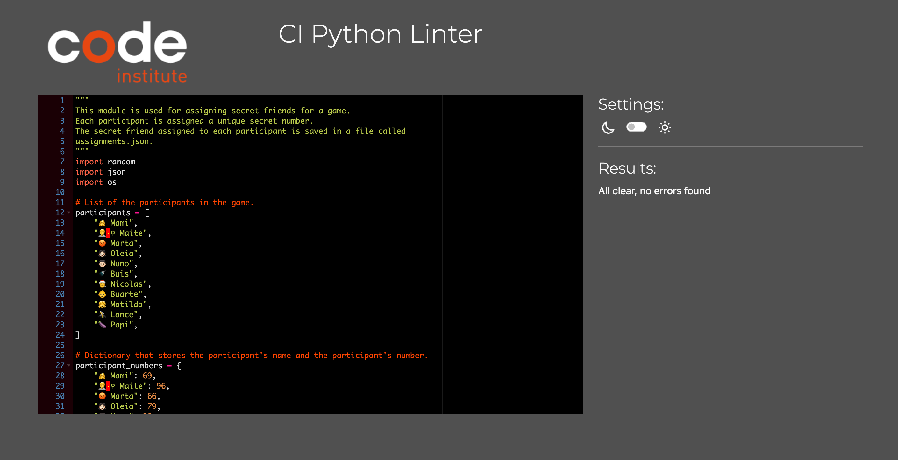

Link to the live project: [Amigo Invisible App](https://tuminha-amigo-invisible-app-sx1moy.streamlit.app)


## Table of Contents

1. [Amigo Invisible (Secret Santa) App Overview](#amigo-invisible-secret-santa-app-overview)
2. [How the App Works](#how-the-app-works)
   - 2.1. [Random Assignment](#random-assignment)
   - 2.2. [Participant Anonymity](#participant-anonymity)
   - 2.3. [Streamlit Frontend](#streamlit-frontend)
   - 2.4. [Gift Giving Made Easy](#gift-giving-made-easy)
3. [Features of the Amigo Invisible (Secret Santa) App](#features-of-the-amigo-invisible-secret-santa-app)
   - 3.1. [Secret Number Assignment](#secret-number-assignment)
   - 3.2. [Check-In Functionality](#check-in-functionality)
   - 3.3. [AI-Powered Gift Recommendations](#ai-powered-gift-recommendations)
4. [Technologies Used](#technologies-used)
   - 4.1. [Python](#python)
   - 4.2. [Streamlit](#streamlit)
   - 4.3. [OpenAI's GPT-4 API](#openais-gpt-4-api)
   - 4.4. [Additional Libraries and Tools](#additional-libraries-and-tools)
   - 4.5. [Development Tools](#development-tools)
5. [Existing Features](#existing-features)
   - 5.1. [Welcome Screen](#welcome-screen)
   - 5.2. [Main Menu](#main-menu)
   - 5.3. [Participant Assignment and Check-In](#participant-assignment-and-check-in)
   - 5.4. [AI-Powered Gift Recommendations](#ai-powered-gift-recommendations)
   - 5.5. [Responsive Web Interface](#responsive-web-interface)
   - 5.6. [Administrative Features](#administrative-features)
6. [Features Left to Implement](#features-left-to-implement)
7. [Testing](#testing)
   - 7.1. [General Testing](#general-testing)
   - 7.2. [Development and Deployment Environment](#development-and-deployment-environment)
   - 7.3. [PEP8 Compliance](#pep8-compliance)
   - 7.4. [Automated Testing](#automated-testing)
   - 7.5. [User Stories Testing](#user-stories-testing)
   - 7.6. [Lighthouse Performance Report](#lighthouse-performance-report)
8. [Bugs and Fixes](#bugs-and-fixes)
   - 8.1. [Encountered Issues](#encountered-issues)
   - 8.2. [Unresolved Issues](#unresolved-issues)
9. [Testing Approach and Results](#testing-approach-and-results)
   - 9.1. [Manual Testing Highlights](#manual-testing-highlights)
   - 9.2. [Automated Testing Highlights](#automated-testing-highlights)
   - 9.3. [Test Execution](#test-execution)
   - 9.4. [Test File Reference](#test-file-reference)
10. [Deployment](#deployment)
11. [Fork and Clone](#fork-and-clone)
12. [Acknowledgements and Credits](#acknowledgements-and-credits)


## Amigo Invisible (Secret Santa) App Overview

The Amigo Invisible, or Secret Santa, is an innovative app designed to add fun and simplicity to the traditional Secret Santa game. The core purpose of this app is to facilitate families, friends, or colleagues in randomly assigning a 'secret friend' or 'secret Santa' to each participant in an unbiased and exciting manner.

## How the App Works

### Random Assignment
Utilizing a Python-based backend, the app intelligently shuffles a list of participants and randomly assigns each person a 'secret Santa'.

### Participant Anonymity
Each participant is assigned a unique secret number to maintain confidentiality.

### Streamlit Frontend
To enhance user experience, the app boasts a user-friendly frontend developed with Streamlit. Participants can simply input their secret number on this interface to discover who their secret Santa is.

### Gift Giving Made Easy
The overarching goal is to ensure every participant is assigned someone who will thoughtfully select and give a present, making the gift exchange process seamless and enjoyable.

This app is more than just a tool; it's a digital facilitator of joy and surprise, making your Secret Santa event hassle-free and memorable.

## Features of the Amigo Invisible (Secret Santa) App

The Amigo Invisible app is designed with user engagement and convenience in mind, offering a suite of features that enhance the Secret Santa experience. These features are categorized into three primary sections:

### Secret Number Assignment:

Each participant is assigned a unique secret number by the administrator of the game.
This number is confidentially communicated from the administrator to the participant.
Participants enter their secret number into the app to reveal their assigned Secret Santa. This process ensures anonymity and adds an element of surprise to the gift exchange.

### Check-In Functionality:

The app includes a 'Check-In' feature, which allows participants to confirm their participation and assignment.
Once a participant checks in, the information is updated in the app's frontend. This feature provides transparency, enabling other participants to see who has already been assigned a secret friend.

### AI-Powered Gift Recommendations:

A standout feature of the app is its integration with an AI-powered recommendation system.
By leveraging OpenAI's language models through an API, the app offers personalized gift suggestions.
Participants simply input their budget, and the AI suggests suitable gifts for their secret friend. This innovative feature takes the guesswork out of gift selection, ensuring thoughtful and appropriate presents within the set budget.

These carefully crafted features make the Amigo Invisible app not just a tool for organizing Secret Santa events but a comprehensive platform that enhances the entire experience, from assignment to gift selection, fostering a joyful and memorable holiday tradition.

## Technologies Used

The Amigo Invisible app is built using a variety of technologies, libraries, and tools that together create a seamless and user-friendly experience. Below is an overview of the key technologies utilized:

### Python

Python: The core language used for the backend development of the app, known for its simplicity and readability.
JSON: Utilized for data storage and manipulation, particularly for managing participant assignments.
OS Module: Integrated for interacting with the operating system, such as checking for the existence of files.
Random Module: Employed to ensure the randomness in the assignment of Secret Santas, crucial for the fairness of the game.

### Streamlit

Streamlit: An innovative framework for building interactive and intuitive web applications entirely in Python. Used for creating the frontend of the app, offering participants a user-friendly interface to interact with.

### OpenAI's GPT-4 API

OpenAI's GPT-4 API: Leveraged for integrating advanced AI capabilities into the app. The API is used to provide AI-powered gift recommendations, enhancing the user experience by suggesting creative and thoughtful gift ideas.

### Additional Libraries and Tools

Dotenv: For managing environment variables, ensuring sensitive information such as API keys are securely handled.
OpenAI Python Client: A Python library provided by OpenAI for easy integration of their language models into applications.

### Development Tools

Git: Used for version control, allowing for effective tracking and management of code changes.
GitHub: Hosts the code repository and facilitates version control and collaboration.
Visual Studio Code: The chosen Integrated Development Environment (IDE) for writing and editing the code, known for its robust features and support for Python development.

## Existing Features
### Welcome Screen
**Initial Interaction:** Upon launching the app, users are greeted with a welcoming interface.
**Participant Number Entry:** Participants are prompted to enter their unique secret number to proceed.

### Main Menu
**Secret Friend Reveal:** After entering a valid number, participants can discover their secret Santa.
**Instructions and Rules:** Clear guidelines are provided on how to participate and engage with the app.

### Participant Assignment and Check-In
**Random Secret Santa Assignment:** The app assigns a secret Santa to each participant in a random and fair manner.
**Check-In Functionality:** Participants can check in, and the app updates this status for all users to see.
**Transparency and Engagement:** The app promotes a transparent process where everyone knows who has checked in.
**Real-Time Updates:** After the check-in, the list of users that have already checked in is updated and visible to everyone. However, the page needs to be refreshed to see the updated list.


### AI-Powered Gift Recommendations
**Interactive Gift Suggestion:** Participants can use the OpenAI-powered feature to get gift suggestions.
**Personalized Experience:** By inputting their budget and the assigned secret friend, users receive customized gift ideas.
**Enhanced User Experience:** This feature adds a layer of innovation and fun to the gift selection process.

### Responsive Web Interface
**Streamlit Framework:** The app's frontend, built with Streamlit, offers a responsive and intuitive user interface.
**Cross-Platform Accessibility:** Accessible on various devices, ensuring a wide reach among users.

### Administrative Features
**Game Reset Option:** Administrators can reset the game, including reassigning secret Santas, using a secure password.


**Data Management:** Efficient handling of participant data and assignments through JSON file manipulation.
**Environment Variables:** Secure management of API keys and sensitive data using the dotenv library.
**Error Handling:** The app provides informative error messages for invalid inputs or file access issues.


## Features Left to Implement
**Multilingual Support:** To cater to a diverse user base by providing multiple language options.
**Enhanced Customization:** Allowing users to add personal touches, like custom messages to their secret friends.
**Participant Dashboard:** A feature for participants to view past games, their gift history, and more.
**Mobile App Version:** Expanding the platform to a dedicated mobile application for increased accessibility.

## Testing

### General Testing
The Amigo Invisible app underwent rigorous testing to ensure functionality, usability, and reliability. Testing was conducted across various aspects of the application, including code quality, user interaction, and AI integration.

### Development and Deployment Environment
The app was developed and tested in a robust development environment, ensuring consistent performance across different platforms. Additionally, the app was deployed and tested to confirm its functionality in a live setting.

### PEP8 Compliance
Code quality was a priority, and as such, all Python files (amigo_invisible.py, app.py) were checked for PEP 8 compliance using the Code Institute's PEP8 online tool. The results indicated 100% compliance, with no errors found across all files.




### Automated Testing
Automated tests were written and run using Python's unittest framework, ensuring that all core functionalities of the application were working as expected. The test.py file contains a suite of tests that cover various scenarios, including participant assignment, secret friend revelation, and error handling. All tests were executed successfully, confirming the robustness of the application logic.


### User Stories Testing
Testing was also aligned with user stories to ensure that the app met the needs and expectations of its users. Each user story was methodically tested to verify that the app provided the intended experience and functionality.

#### Participant Number Entry:
* Action: Participants enter their secret number.
* Expected Result: The app reveals the assigned secret Santa.
* Actual Result: Worked as expected.


#### Check-In Functionality:
* Action: Participants use the check-in feature.
* Expected Result: The app updates the check-in status.
* Actual Result: Worked as expected.


#### AI-Powered Gift Recommendations:
* Action: Users input their budget and get gift suggestions.
* Expected Result: The app provides relevant gift recommendations.
* Actual Result: Worked as expected, with AI suggestions aligning with user inputs.


#### Game Reset by Admin:
* Action: Admin enters the reset password and resets the game.
* Expected Result: The game resets and reassigns secret Santas.
* Actual Result: Functioned correctly, allowing for a fresh start of the game.


### Lighthouse Performance Report
The Amigo Invisible app was evaluated using Google Lighthouse, an open-source, automated tool for improving the quality of web pages. The Lighthouse report provides an overview of the app's performance, accessibility, best practices, and search engine optimization (SEO).

#### Lighthouse Scores
* Performance: 59
* Accessibility: 75
* Best Practices: 100
* SEO: 90


#### Diagnostics and Opportunities for Improvement
##### Enable Text Compression
* Issue: Potential savings of 25 KiB due to text-based resources not being compressed.
* Impact: Compressing resources with gzip, deflate, or Brotli can significantly reduce network bytes.
* Suggestion: Implement compression on the server to minimize the total size of text-based resources.

##### Initial Server Response Time
* Issue: The root document's server response time was 7,970 ms, which is quite high.
* Impact: A slow initial response can delay all subsequent resource loads, affecting the user experience.
* Suggestion: Investigate backend performance bottlenecks, optimize server configurations, or consider a more robust hosting solution to reduce Time to First Byte (TTFB).

##### Largest Contentful Paint (LCP)
* Issue: The LCP occurred at 5,830 ms, indicating a delay before the largest content element becomes visible.
* Element: A paragraph containing text about selecting an amount to spend and choosing a secret friend.
* Suggestion: Optimize critical rendering paths, reduce render-blocking resources, and consider lazy loading for non-critical assets.

##### Cache Policy
* Issue: Four resources lack an efficient cache policy.
* Impact: Without caching, these resources must be downloaded every time, increasing load times on repeat visits.
* Suggestion: Implement a cache policy for static assets with long TTL (time-to-live) values to speed up repeat visits.

#### Insights and Next Steps
The app demonstrates strong adherence to best practices and SEO, as indicated by the perfect scores in these categories. However, performance and accessibility offer room for improvement. Consider the following actions to enhance the app's Lighthouse scores:

* Employ a Content Delivery Network (CDN) to serve compressed and cached content efficiently.
* Review and optimize image sizes, apply image compression, and use modern formats like WebP.
* Minimize the number and size of critical resources to improve load times.
* Ensure that all text elements are easily readable and accessible to all users, potentially increasing the accessibility score.

By addressing these areas, the app can achieve better performance, faster load times, and an improved overall user experience, further ensuring that it meets the high standards expected by users and search engines alike.

## Bugs and Fixes

Throughout the development of the Amigo Invisible app, several challenging and interesting bugs were encountered and subsequently resolved. Below is an overview of notable issues and their solutions:

### Encountered Issues

#### Import Errors in Testing

During the unit testing phase, issues arose with the import statements. Functions like get_name and get_secret_friend could not be imported from the amigo_invisible.amigo_invisible module, leading to failed tests and import errors.

**Solution:** The functions were initially nested within assign_secret_friend, making them inaccessible to the test module. The code was refactored to define these functions at the top level of the amigo_invisible.py file, ensuring they were importable and testable.

#### Conflicts with Variable Declarations

The assignments dictionary was used before its definition within certain functions, causing conflicts and undefined variable errors.

**Solution:** The assignments variable was intended to hold data loaded from a file, rather than being a global variable. The functions were refactored to accept assignments as a parameter, ensuring it was defined prior to use. This change also involved updating the logic to handle cases where the assignments.json file did not exist.

### Unresolved Issues

At present, there are no known unresolved issues. The application has been thoroughly tested, and all identified bugs have been addressed. Continuous testing is part of the development process to ensure any new issues are promptly identified and resolved.

## Testing Approach and Results

The app was tested both manually and automatically to ensure robustness and reliability. Manual testing involved simulating user interactions and attempting to "break" the app with unexpected inputs. Automated testing was conducted using Python's unittest framework, covering various scenarios and edge cases.

### Manual Testing Highlights

* Running from Root Directory: The app was tested to ensure that it runs correctly when executed from the root directory of the project, resolving any potential path-related issues.
* User Interaction Flow: All user paths, including entering secret numbers, checking in, and receiving AI-powered gift recommendations, were tested for smooth operation.

### Automated Testing Highlights

* Unique and Valid Assignments: The logic for assigning secret friends was tested to ensure all assignments were unique and valid.
* Check-in Functionality: The check-in process was tested for accurate status updates and appropriate user feedback.
* Error Handling: The app's error handling was verified to ensure informative messages were provided for invalid inputs or file access issues.

### Test Execution

To run the tests, execute the following command from the root directory:

```shell
python -m unittest discover tests
```
All tests should pass without errors, confirming the integrity of the application.

### Test File Reference

The test_amigo_invisible.py file includes comprehensive tests for all functionalities of the Amigo Invisible app. Refer to this file for detailed test cases and assertions that validate the application's behavior.


## Deployment

To deploy your `app.py` on Streamlit, follow these general steps which align with Streamlit's own deployment processes:

**Initial Setup:**

1. Make sure your app is in a public GitHub repository.
2. Ensure the repository has a `requirements.txt` file that lists all the necessary Python packages.

**Streamlit Sharing:**

1. Sign up or log in to Streamlit Sharing.
2. Click on "New app" in the upper-right corner of your workspace on the Streamlit Sharing dashboard.

**App Configuration:**

1. Fill in your GitHub repository details, including the repository name, branch, and the path to your `app.py` file.
2. Optionally, you can modify the app URL to a custom subdomain if preferred.

**Deployment:**

1. Once you've configured your app, click "Deploy".
2. Streamlit will automatically set up the environment based on your `requirements.txt` file and deploy your app.
3. You'll receive a URL to access your deployed app.

**Monitoring and Logs:**

1. After deployment, you can monitor your app's performance and view logs directly from the Streamlit Sharing dashboard.

**Updating Your App:**

1. If you make updates to your app, simply commit and push the changes to your GitHub repository.
2. Streamlit Sharing will automatically detect changes to the main branch and redeploy your app.

Remember, Streamlit Sharing is a platform provided by Streamlit which is designed to host and share Streamlit apps easily. It takes care of hosting the app and provides a simple way for users to deploy their Python scripts as web applications.

If you encounter any issues during deployment, check the Streamlit forums and documentation for troubleshooting tips and community support.

## Fork and Clone

If you're interested in contributing to the Amigo Invisible app or would like to customize it for your own use, you can fork and clone the repository using the following steps:

### Fork the Repository

1. Go to the [Amigo Invisible repository on GitHub](https://github.com/Tuminha/Amigo-Invisible).
2. In the top-right corner of the page, click the "Fork" button.
3. On the "Create a new fork" page, you have the option to rename the repository for your account.
4. Click on the "Create fork" button to create a copy of the repository in your GitHub account.

### Clone the Repository

To clone the repository and work on it locally on your machine:

1. After forking the repository, go to your GitHub profile and click on "Repositories".
2. Find and click on the forked "Amigo Invisible" repository.
3. Inside the repository, click on the "Code" button.
4. Ensure you're under the "HTTPS" tab and copy the provided link.
5. Open your IDE or terminal and navigate to the directory where you want to clone the repository.
6. Use the following git command to clone the repository:

```shell
git clone https://github.com/YOUR-USERNAME/Amigo-Invisible
```
Replace YOUR-USERNAME with your actual GitHub username.

### Customizing Participants

Once you have cloned the repository, you can customize the participants by modifying the `amigo_invisible.py` file. Here's a shell command example to open the file in your editor:

```shell
nano amigo_invisible.py
```
Or, if you're using Visual Studio Code:

```shell
code amigo_invisible.py
```
In the `amigo_invisible.py` file, look for the `participants` list and `participant_numbers` dictionary to update the participant names and numbers to your preference.

## Acknowledgements and Credits

The development of the Amigo Invisible app was supported by a myriad of resources and personal support. I'd like to express my gratitude to the following:

### Educational Resources and Support

[Code Institute](https://codeinstitute.net/): For providing a solid foundation in full-stack development and continuous support throughout my learning journey.
[FreeCodeCamp](https://www.freecodecamp.org/): For a wealth of programming tutorials and exercises that have been instrumental in my coding practice.
[DEVS](https://devs.com/): For the insightful articles and community discussions that have broadened my understanding of software development.
[Real Python](https://realpython.com/): For their in-depth Python tutorials and resources which were extremely helpful in refining the app's logic and features.
[Stack Overflow](https://stackoverflow.com/): For being the go-to platform for resolving coding issues and learning from fellow developers.

### Personal Support

My wife and five children: For their unwavering patience, encouragement, and understanding, as I dedicated time and effort to this project.
The Student Care team at the [Code Institute](https://codeinstitute.net/): For their support and assistance whenever I faced challenges.
My classmates and the [Slack](https://slack.com/) community: For sharing tips, tricks, and providing a sense of camaraderie.
